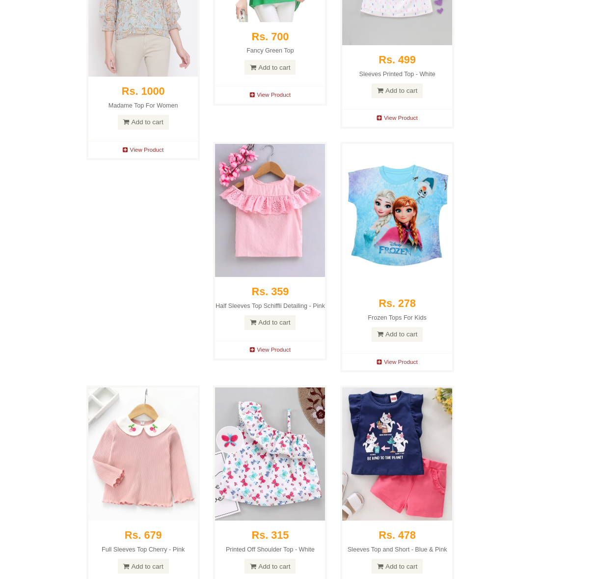
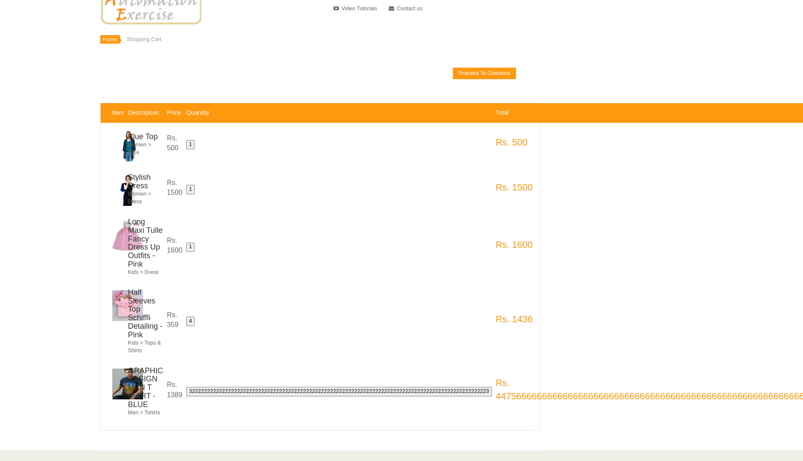

# Bug Reporting

---

## 1. API Returns Incorrect HTTP Status Codes

**Component:** Public API (`/api/verifyLogin`, `/api/createAccount`, and [others](https://www.automationexercise.com/api_list))

### Steps to Reproduce
1. Make API calls with invalid credentials, or create accounts via `/api/createAccount`
2. Observe HTTP status code and payload

### Expected Result Examples
- `/api/verifyLogin` should return:
    - **HTTP 401** for invalid credentials
- `/api/createAccount` should return:
    - **HTTP 201** (Created) on success

### Actual Result
- All endpoints always return **HTTP 200** `.status_code`, even for errors.
- Error type is indicated **only** in JSON payload: e.g. `{"responseCode": 404, ...}`
- `/api/verifyLogin` returns:
    - **HTTP 404** for invalid credentials (should be 401)
- `/api/createAccount` returns:
    - **HTTP 200** instead of 201 on success

### Expected Behavior
- All APIs should return **correct HTTP status codes** matching REST/HTTP standards for each outcome.

### Workaround
- Automated tests must assert on the `responseCode` in JSON (not `.status_code`).

### Impact
| Area           | Consequences                                        |
|----------------|-----------------------------------------------------|
| API Behavior   | Misleads clients about true result of operation     |
| Client Handling| Forces all clients to parse JSON for error handling |
| Standards      | Violates REST and HTTP standards                    |

### Severity
**Minor**

### Affected Tests
- `tests/api/test_basic_api_login_tests.py::test_verify_login_cases`
- `tests/api/test_user_profile_api.py::test_create_delete_account`
- `tests/ui/test_user_profile_ui.py::test_delete_account_via_ui_and_verify_api`
---

## 2. Modal Blocks UI and Cannot Be Closed by Clicking Outside

### Steps to Reproduce
1. Add any product to cart (main page or product details)
2. Observe modal appears ("Continue Shopping" / "View Cart")
3. Attempt to click outside modal (on overlay/background)

### Expected Result
- Clicking outside modal (overlay) should dismiss it
- Background UI should remain interactable

### Actual Result
- Modal remains visible despite overlay clicks
- UI is fully blocked while modal is open
- Only closes via explicit button

### Expected Behavior
- Overlay click should close modal
- Background should be usable

### Workaround
- User must explicitly click "Continue Shopping" or "View Cart"

### Impact
| Area         | Consequences                                   |
|--------------|-----------------------------------------------|
| UX           | Poor discoverability, violates expectations   |
| Accessibility| Traps keyboard/screen reader users           |
| Performance  | Slows multi-item workflows                   |
| Mobile       | Especially frustrating on touch devices       |

### Severity
**Medium**

### Affected Tests
- `tests/ui/test_shopping_modal.py::test_modal_overlay_click_closes_modal`
---

## 3. Cart Quantity Modification Not Working

### Steps to Reproduce
1. Add product to cart
2. Go to cart, try to change product quantity (via "+" or "-" or manual entry)

### Expected Result
- User can increase/decrease quantity in cart (max 99/min 1)
- Manual input accepts only numbers

### Actual Result
- No "+" or "-" buttons in cart
- Input field ignores keyboard input

### Expected Behavior
- Cart should allow changing quantities easily

### Workaround
- Only way to change is by deleting and re-adding products

### Impact
| Area | Consequences                           |
|------|----------------------------------------|
| UX   | Can't adjust quantities in cart        |
| Sales| Customers may abandon cart             |

### Severity
**High**

### Affected Tests
- `tests/ui/test_cart.py::test_cart_quantity_editable`

---

## 4. Product Images Not Clickable

### Steps to Reproduce
1. Add product
2. Go to cart
3. Click on product image

### Expected Result
- Clicking product image should open product details page

### Actual Result
- Nothing happens on click

### Expected Behavior
- Product images are links to detail pages (industry standard)

### Workaround
- User must return to main page and search manually

### Impact
| Area       | Consequences                    |
|------------|---------------------------------|
| Engagement | Reduces product interaction     |
| Standards  | Violates e-commerce conventions |

### Severity
**Medium**

### Affected Tests
- `tests/ui/test_cart.py::test_cart_product_image_redirects_to_details`

---

## 5. Add to Cart Modal Delay (2-3 Seconds)

### Steps to Reproduce
1. Click any "Add to Cart" button
2. Measure time until modal appears

### Expected Result
- Modal should appear instantly (<200ms)
- UI remains responsive

### Actual Result
- 2-3 second delay before modal displays
- No loading indicator

### Expected Behavior
- Modal appears immediately or shows a loader

### Workaround
- None

### Technical Notes
- Not correlated with network activity

### Impact
| Area | Consequences                                 |
|------|----------------------------------------------|
| UX   | Perception of broken, slow functionality     |
| Sales| Users may abandon before modal appears       |
| Brand| Site feels outdated/unresponsive             |

### Severity
**High** (Blocks purchase flow)

### Affected Tests
- `tests/ui/test_shopping_modal.py::test_visibility_time_modal`

---

## 6. Product Listing Visual Layout Bug

### Steps to Reproduce
1. Visit main page
2. Observe product cards/grid alignment

### Expected Result
- All cards have equal height and perfect grid alignment

### Actual Result
- Cards have varying heights; rows misalign
- Large vertical gaps and uneven layout
- Visually distracting

### Expected Behavior
- Clean, even product grid

### Workaround
- None

### Impact
| Area         | Consequences                       |
|--------------|------------------------------------|
| UX           | Harder to scan/compare products    |
| Aesthetics   | Reduces trust, looks unprofessional|
| Accessibility| Challenging for visually impaired  |

### Severity
**Medium**

### Affected Tests
- _no automated test yet_

---

## 7. Not Enough Input Restriction on Numeric and Text Fields

### Steps to Reproduce
1. Enter absurd values (googol, negative, decimals, spaces) in product quantity in product details page or
commentary text fields (name, email, comments)
2. Submit; check result in cart or DB

### Expected Result
- Only 1-4 digit positive integers accepted for quantity
- All text fields should have sane max length and allowed chars
- Out-of-range/non-numeric input blocked with feedback

### Actual Result
- Field accepts or resets all input, including negative/decimal/giant numbers
- No visible error for invalid entries
- Huge numbers break UI  
  

### Expected Behavior
- Input controls enforce frontend and backend validation

### Workaround
- None

### Impact
| Area       | Consequences                      |
|------------|----------------------------------|
| UX         | Confusing, allows broken orders   |
| Security   | Potential for abuse/DoS           |
| Data       | DB errors, analytics distortion   |

### Severity
**High**

### Affected Tests
- `tests/ui/test_cart.py::test_add_massive_quantity`
- `tests/ui/test_product_details.py::test_quantity_non_integer_input_rejected`