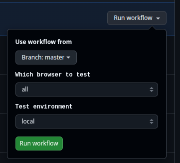

# Jacek's QA Demo Repository

TL;DR: 
Modern, Dockerized, reproducible tests repository with CI, parallelization, and artifacts—ready for your next team!

Hello QA/HR Adventurer!

I’m happy to share this skill-demonstrative repository, which provides a structured and automated framework for 
executing UI and API tests using Python, Selenium, PyTest, and Docker. It supports running tests in parallel, generating
detailed reports, capturing screenshots on test failures, and simplifies configuration management.
The repository includes a changelog, tagged versions, and a robust GitHub Actions CI setup.

My goal is to showcase my experience in building professional, reliable test repositories to accelerate and smoothen the
recruitment process.

This README is intentionally thorough: I like my documentation to be well-structured, informative, and full of 
easy-to-use examples. I’ve added a Detailed Workflow section for a quick grasp of how the repository works.

After more than 5 years as QA Engineer with the Piwik PRO Analytics team, I’ve overcome many challenges and handled
responsibilities that required timely and professional delivery. I worked in an agile process with around 10 developers,
had a lot of freedom of action, and was engaged in idea conception and new solutions at early stages. 
My work split was about 40% manual testing and 60% coding.

Tests you can find in this repository are not meant to show every case that could have been covered by them, but as a showcase
of my approach to building test suite.

If you like what you see — hire me!

Jacek

---

## License

This project is released under a limited-use license. See the [LICENSE](LICENSE) file for details.

---
## Technologies

* **Python 3.12**
* **Selenium**
* **PyTest** (including plugins: `pytest-xdist`, `pytest-html`)
* **Docker** & **Docker Compose** (must be installed separately)
* **Poetry** (dependency management)
* **pre-commit** (linters)

---
## Setup

### Prerequisites

Ensure [Docker](https://docs.docker.com/get-docker/) and [Docker Compose](https://docs.docker.com/compose/install/) are installed

Verify installations:

```
docker --version
docker compose version
```
---
### 1. Clone the repository

```
git clone https://github.com/gwojacek/qa-demo-repository.git
cd qa-demo-repository
```
### 2. Install Poetry (if not installed)
Poetry is required for dependency management. You only need to install it once per machine.

Check if Poetry is already installed:
```
poetry --version

```
If not, then:
```

curl -sSL https://install.python-poetry.org | python3 -
export PATH="$HOME/.local/bin:$PATH"
```
For more detailed information and advanced installation options, you can refer to the official Poetry documentation:

[Poetry Installation Guide](https://python-poetry.org/docs/#installing-with-the-official-installer)

---

### 3. (Optional) Install TigerVNC for VNC/Visual Debugging

If you want to use the `-v` (VNC) mode for visual debugging of browser sessions, you need TigerVNC installed on your 
local machine.

**Install on Ubuntu/Debian:**

```
sudo apt-get update
sudo apt-get install tigervnc-viewer
```

You only need this if you use `-v` in your test command (e.g., `./run_tests.sh -b chrome -m ui -v`).
No installation is needed for headless or CI runs.

---

### 4. Install Python dependencies using Poetry

```
poetry install
```
---
## Configuration

Tests rely on environment-specific configuration files located in the root directory:

* `localconf_local.env`
* `localconf_staging.env`

Create these manually:

```env
# localconf_local.env
ADDRESS="https://www.automationexercise.com/"


# localconf_staging.env
ADDRESS="https://www.automationexercise.com/"

```

The correct file is automatically loaded based on the environment you specify with `-e`.

---
## Executing Tests

The `run_tests.sh` script manages test execution with several customizable options:

* `-b`: Browser selection (`chrome`, `opera`)
* `-m`: PyTest marker (**required**) (e.g., `ui`, `api`, or other)
* `-n`: Number of parallel workers (specific number)
* `-H`: Disable headless mode (useful for debugging)
* `-v`: Enable VNC viewer mode (visual test execution)
* `-e`: Environment type (`local`, `staging`)


**Notes:**

* The **`-m` marker is required** to specify which tests to run.
* If you do not provide `-b`, the browser defaults to **chrome**.
* If you do not provide `-n`, workers default to **auto**.
* If you do not provide `-e`, environment defaults to **local**.
* **Headless mode is enabled by default** unless you add `-H` or `-v`.


## Run Tests Examples

```
# Run UI tests on Chrome (browser defaults to chrome)
./run_tests.sh -m ui

# Run API tests on Opera with specific environment (overrides browser and environment)
./run_tests.sh -b opera -m api -e staging

# Run UI tests with 4 parallel workers (overrides workers)
./run_tests.sh -n 4 -m ui

# Run UI tests with VNC mode (disables headless, sets workers=1)
./run_tests.sh -b chrome -m ui -v
```

---
## Debugging

When UI tests fail, automatic screenshots are saved to:

```
tests/artifacts/
```

These screenshots are also embedded within HTML test reports generated by PyTest.

The test report is directly accessible and clickable via the test output, e.g.:

```
-------- Generated html report: file://$(pwd)/tests/artifacts/report.html --------
```
---

## Running Linters

You can execute linters using Poetry  - it runs black, isort and flake8:

```
poetry run lints
```
---

## Commitizen

This repository uses [Commitizen](https://commitizen-tools.github.io/commitizen/) to enforce Conventional Commits and manage release versions. Commit messages are validated via a pre-commit hook.

### Making commits

- add files by `git add .` for all changes or with specified files.

- instead of `git commit`, use:  
`poetry run cz commit`

- fill up questionare form

- `git push`

### Releasing a new version

When you're ready to release:  
`poetry run cz bump`

This command:
- Analyzes commit history
- Updates `pyproject.toml`
- Amends `Changelog.md`
- Creates a Git tag (e.g., `v1.0.1`)

**Important:** Version numbers only change when `poetry run cz bump` is executed, not on every commit.

---


## Test Markers

Markers help categorize tests, making selective execution straightforward during test runs. Example markers defined in
`utils/markers.py`:

```
ui = pytest.mark.ui
api = pytest.mark.api
```

You can create additional markers for your specific testing needs.

---

## Detailed Workflow

### 1. **Starting the Test (`./run_tests.sh ...`)**

* The `run_tests.sh` Bash script is your entrypoint. It parses arguments (browser, marker, workers, VNC/headless, 
environment).
* Based on these options, it selects which Selenium container(s) to start, and sets up environment variables.

---

### 2. **Docker Compose Brings Up Selenium Containers**

* The script runs `docker compose up -d <service>` to start the necessary Selenium service:

  * **Chrome:** `selenium-chrome` (headless) or `selenium-chrome-debug` (with VNC).
  * Chrome and Opera services expose 5 parallel slots to accommodate concurrent test runs.
  * **Opera:** `selenium-opera` or `selenium-opera-debug`.
* **What happens under the hood?**

  * `docker-compose.yml` defines services, ports, and any driver volumes needed (for Opera).
  * Images like `selenium/standalone-chrome:latest` are pulled if not present locally.
  * Debug containers expose VNC ports so you can watch the browser interactively.

---

### 3. **Test Runner Container is Built (Dockerfile)**

* The script calls `docker compose build test-runner` to build your application’s test image:

  1. **FROM python:3.12-slim**

     * Uses a minimal official Python base image for speed and small size.
  2. **System Dependencies**

     * Installs `curl` and `git`, required by various tools and possibly your CI.
  3. **Poetry Install**

     * Installs Poetry to manage Python dependencies.
  4. **Disable Poetry Virtualenvs**

     * Configures Poetry to install everything to the global `/usr/local` site-packages instead of making a `.venv` 
     folder.
  5. **Copy Manifest & Install Dependencies**

     * `COPY pyproject.toml poetry.lock ./` then `poetry install --no-root --no-interaction` installs all requirements 
     (but not your app code yet).
  6. **Copy Application Code**

     * `COPY . .` brings all source code, tests, configs, and scripts into the container.
  7. **Entrypoint**

     * Sets `ENTRYPOINT ["pytest"]`, so any command run in the container defaults to pytest unless overridden.
* **Result:**
  You now have a reproducible, isolated test runner container that can be run anywhere Docker works.

---

### 4. **Running Pytest Inside the Container**

* The `docker compose run --rm ... test-runner ...` command starts the container, passing environment variables like 
* `BROWSER`, `HEADLESS`, `SELENIUM_REMOTE_URL`, and `ENV_TYPE`.
* Inside the container:

  * Poetry dependencies are already installed (from the build step).
  * Your code is present and `pytest` is invoked with the correct arguments (markers, xdist, HTML report, etc).

---

### 5. **Connecting to Selenium via Remote WebDriver**

* The `driver()` fixture in `conftest.py` reads `SELENIUM_REMOTE_URL` (e.g., `http://selenium-chrome:4444/wd/hub`).
* The container's `pytest` tests connect to Selenium Grid (in its own container) to launch browsers inside the Selenium 
service containers.

---

### 6. **Test Execution, Reporting, and Artifacts**

* Tests run in parallel (pytest-xdist) and by marker (e.g., only ui or api or other).
* If a test fails, xfails, a screenshot is taken and saved to `tests/artifacts/`.
* Pytest-html generates a self-contained HTML report, which also embeds screenshots of failed tests.

---

### 7. **Test Completion and Docker Cleanup**

* After the test run, the script cleans up:

  * `docker compose down` stops and removes all running Selenium containers.
  * Any VNC viewer started locally is also killed.
* The report is accessible at `tests/artifacts/report.html`.

---

## Bug Tracking

Discovered issues are logged in https://github.com/gwojacek/qa-demo-repository/issues as a showcase of how I handle 
bugs. Tests are marked `xfail` or `skip` or have comments about the bug until those bugs are fixed by devs.

---
## Visual Summary

```
run_tests.sh
  │
  ├── docker compose up [Selenium]         ← start browser containers
  ├── docker compose build test-runner     ← build your code & deps into container
  ├── docker compose run test-runner       ← run tests inside isolated env
  │     └─ pytest discovers, runs, reports, screenshots
  └── docker compose down                  ← cleanup all containers
```

---

## 8. CI Integration – Detailed Flow (GitHub Actions)

### **A. Triggering the Workflow**

* The workflow (see `.github/workflows/ci.yml`) is triggered automatically by:

  * A `push` to `master`
  * A scheduled CRON job (e.g., nightly)
  * A manual run via **workflow\_dispatch** (which allows for browser/environment selection). 
  **Unfortunately only authenticated users with write (push) access can actually start the workflow run**
  

---

### **B. Job Matrix & Browser Selection**

* The workflow uses a **matrix** to run tests for each:

  * Browser (`chrome`, `opera`, or both)
  * Test block/marker (`ui`, `api`, others)
* This means jobs run in parallel for combinations (e.g., UI+Chrome, API+Opera).

---

### **C. Steps in Each Job**

#### 1. **Checkout Repository**

* Uses `actions/checkout@v4` to get the latest source code.

#### 2. **Install Docker Compose**

* Ensures the CI environment (usually `ubuntu-latest`) has Docker Compose installed.

#### 3. **Environment File Preparation**

* Dynamically creates either `localconf_local.env` or `localconf_staging.env` based on workflow inputs:

  * **Security:** The contents of these files come from **GitHub Secrets**, not from the repository (keeps sensitive 
  data safe).

#### 4. **Show Test Context**

* Logs which testblock, environment, and browser are being run (handy for CI logs).

#### 5. **Run Tests via Bash Script**

* Executes `./run_tests.sh` with the right parameters:

  * `-b` for browser (chrome/opera)
  * `-m` for test block (ui/api)
  * `-e` for environment (local/staging)
* All Docker orchestration and test logic runs exactly as described earlier.

#### 6. **Collect and Prepare Artifacts**

* After the test run, all generated artifacts (`report.html` and screenshots) are copied to a temporary output directory
  under the browser and test block. Examples: `out/chrome/ui/`, `out/chrome/api/`,
  `out/opera/ui/`, etc.

#### 7. **Publish Report to GitHub Pages**

* Uses [`peaceiris/actions-gh-pages`](https://github.com/peaceiris/actions-gh-pages) to publish the HTML report and screenshots to the `gh-pages` branch.
* **Result:** Test results are easily browsable at
  `https://<org>.github.io/<repo>/chrome/<block>/` or `/opera/<block>/`. 
   Working example: https://gwojacek.github.io/qa-demo-repository/opera/usertests/


#### 8. **Log Report URLs**

* The workflow prints a clickable link to the report directly in the CI summary for convenience.

#### 9. **Summarize Environment in Workflow Summary**

* Adds a concise summary line (which block, browser, environment) to the **GitHub Actions summary** panel, improving 
auditability.

---

### **D. Key Security & Portability Points**

* **Secrets (env files)** are passed via [GitHub Secrets](https://docs.github.com/en/actions/security-guides/encrypted-secrets), never stored in your repo.
* **Docker and test logic is identical** in CI and locally.
* **Artifacts (reports, screenshots)** are published and preserved, making test results accessible even to 
non-developers.
